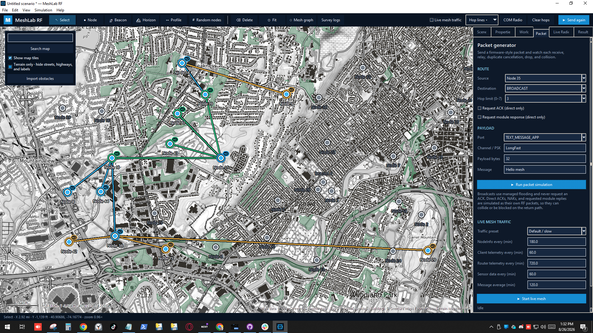
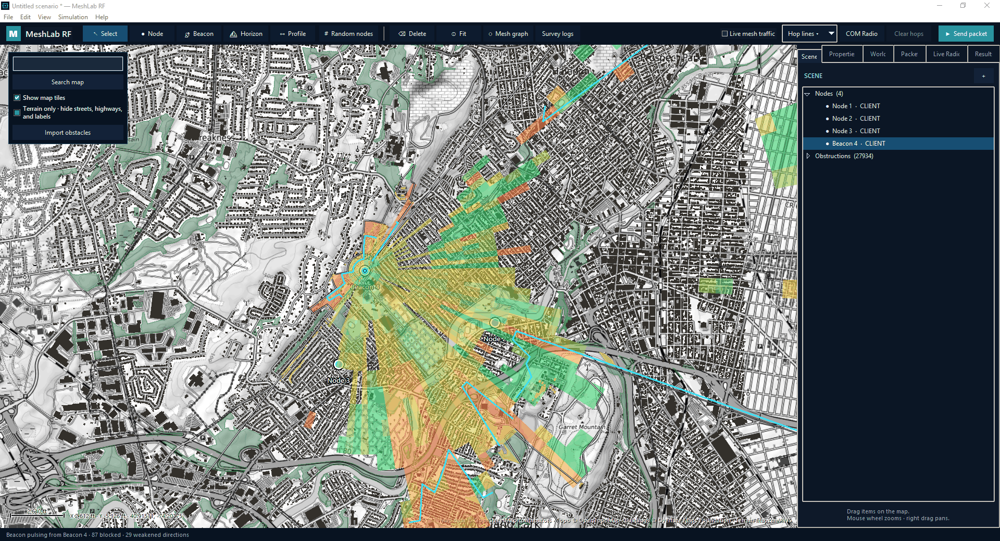
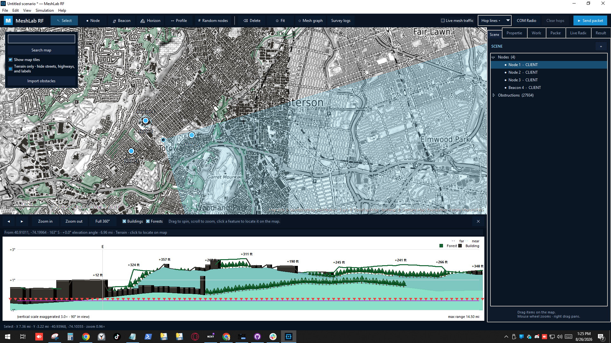
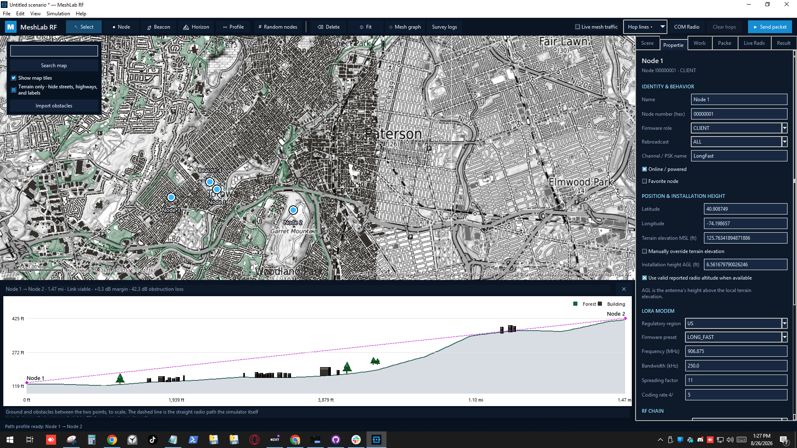

# MeshLab RF

MeshLab RF is a Windows and macOS desktop tool for planning Meshtastic networks. It lets you place radios on a real map, import buildings and forests, use terrain elevation, and watch packets travel from node to node.

Use it to explore coverage, find likely dead spots, compare node locations and heights, and understand how hop limits and node roles affect a mesh. It is a planning aid, not a replacement for an RF site survey.

Most propagation tools stop at topography — a clean line-of-sight check over hills and nothing else. MeshLab RF also charges every building actually standing in the path, using a per-building attenuation value pulled from real field data, not a textbook guess: months of walking real routes through cities, towns, and forests with a [paired GPS/RF survey rig](#field-survey-firmware), logging exactly how much a building knocks down a Meshtastic signal at different distances and angles. The values in this repo are the compilation of that survey work so far.

## See it in action

<div align="center">

<table>
<tr>
<td width="50%" valign="top">

<br><b>Packet hops, live</b><br>
<sub>Send a packet and watch it flood hop by hop across real terrain and buildings, colored and badged H0–H3 by hop count.</sub>
</td>
<td width="50%" valign="top">

<br><b>Coverage heatmap</b><br>
<sub>Drop a beacon and see its live range as a green-to-red ray heatmap, with blocked and weakened directions called out as it pulses.</sub>
</td>
</tr>
<tr>
<td width="50%" valign="top">

<br><b>360° horizon panorama</b><br>
<sub>Stand at any node's real installed height and see the full skyline around it — terrain, buildings, and forest, with obstructions marked.</sub>
</td>
<td width="50%" valign="top">

<br><b>Link profile between nodes</b><br>
<sub>Slice the terrain between two nodes to see exactly what's in the way and how much margin the link has left.</sub>
</td>
</tr>
</table>

</div>

## Field survey firmware

MeshLab RF's building-attenuation model is only as good as the real-world data it's calibrated against. The [`signal_tester/`](signal_tester/) firmware turns a pair of LoRa boards into a purpose-built RF survey tool: one radio walks a route with GPS, the other sits at a fixed base, and they exchange direct probes every few seconds, logging RSSI/SNR for both directions straight to onboard flash — no phone, server, or Meshtastic mesh involved. Walk a route that crosses buildings at different distances and angles, then export both radios' logs into MeshLab RF's **Survey logs** viewer and apply **Calibrate buildings** to fit the model's attenuation value to what you actually measured.

It currently targets the Heltec Mesh Node T114 (GPS, display, and battery already on one board), with the project structured to add other boards later. Ready-to-flash UF2 files are on the [Releases](https://github.com/HarukiToreda/MeshLab-RF/releases) page; see [Build and modify the signal tester firmware](BUILD_FIRMWARE.md) to change it and build your own.

## Run it

Download the latest build from [Releases](https://github.com/HarukiToreda/MeshLab-RF/releases):

- [Windows x64](https://github.com/HarukiToreda/MeshLab-RF/releases/latest/download/MeshLabRF.exe)
- [macOS Apple Silicon](https://github.com/HarukiToreda/MeshLab-RF/releases/latest/download/MeshLabRF-macOS-arm64.dmg)
- [macOS Intel](https://github.com/HarukiToreda/MeshLab-RF/releases/latest/download/MeshLabRF-macOS-x86_64.dmg)

The macOS builds are currently unsigned. On first launch, Control-click **MeshLabRF**, choose **Open**, then confirm.

The app starts with a map but no nodes. Internet access is needed for new map tiles, search, terrain, and obstacle data. Saved scenarios and cached data can be used offline.

## Simple guide

1. Search for the location you want to study.
2. Select **Node**, then click the map to place as many nodes as needed. The tool stays selected.
3. To add many nodes, choose **Random nodes**. They will be spread across the visible area.
4. Choose **Import obstacles** to load buildings and forests. Wider views split into 12 km² (4.63 mi²) tiles. Dense cells subdivide automatically, and re-importing safely fills missing footprints.
5. Select a node and open **Properties** to set its role, radio, power, channel, and height.
6. Open **Packet**, choose the source and destination, set the hop limit, and select **Send packet**.
7. Open **Results** for delivery details, RF values, drops, and collisions.
8. Select **Beacon** (or press **B**) and click the map to drop a beacon that continuously pulses a node’s live coverage.
9. Select **Horizon** and click a node (uses its real installed height) or a bare point to see a 360° panorama of the terrain and obstacle skyline visible from there, including any other node that's geometrically visible.
10. Select **Profile** and click two nodes or points to see the terrain/obstacle cross-section between them. Both Horizon and Profile open in a panel docked under the map; click a spot in either chart to locate that exact point back on the map.

Use the mouse wheel to zoom, right-drag to pan, and **Fit** to frame the current nodes. The scene, properties, world, packet, radio, and results tabs remain docked beside the map.

The node **Device / radio power** selector includes common Heltec, RAK, LILYGO, Seeed, and high-power 1 W families as well as generic radio-chip and measured-output choices. Selecting a model applies its normal conducted power and hardware ceiling; antenna gain and cable loss remain separate fields.

New nodes default to Meshtastic **LONG_FAST** in the US region. Each node has a regulatory-region selector covering Meshtastic's active sub-GHz, 2.4 GHz, and licensed amateur band plans. Selecting a region or firmware preset automatically updates bandwidth, spreading factor, coding rate, default channel name, and the matching regional frequency slot. Region-specific spacing, padding, wide-LoRa bandwidths, fixed amateur slots, and Meshtastic's European preset/region switching are included. A manually entered custom channel name is retained and hashed to its matching regional slot; **CUSTOM** leaves the RF fields editable. The resolved frequency is used by link compatibility and every propagation, beacon, live-mesh, and packet simulation.

## Reading the simulation

- Every send starts with the original ray-styled **coverage heatmap** expanding from the source: strong (green) to weak/intermittent (red), with obstacles that slow it outlined yellow and those that block it red. The globally field-calibrated packet threshold is −4 dB margin, and both the heatmap and actual simulated sends use it. Reception in that red edge remains intermittent when stochastic fading is enabled. Each ray is sampled in sections, so ground below that fringe remains empty and coverage can resume where higher terrain rises back into a usable path. It continues into the hop animation if another node is reached, or stays frozen if none is.
- Broadcasts radiate from every node that receives and rebroadcasts the packet.
- Hop colors and `H0`–`H7` badges show how far the packet traveled.
- Nodes not reached by the completed simulation turn gray.
- Clicking a reached node shows its complete first-arrival path.
- Starting another simulation automatically clears the previous trace.
- **Clear hops** removes the trace without running another simulation.
- **Hop lines** can hide individual hop layers.

Direct messages first use flooding when no route is known. If an ACK returns through the RF mesh, later DMs use only directed hop lines. A failed learned route is removed and the simulator falls back to flooding.

For ongoing traffic, turn on **Live mesh traffic** in the top bar. It runs in real time: one configured minute is one real minute. Set the NodeInfo, client/router telemetry, sensor, and message intervals in **Packet → Live mesh traffic**; firmware-like values are the defaults. While it is on, **Send packet** injects your packet into that same channel load instead of starting an isolated test. Open **Results → Live traffic**, select an injected test, and see every receive, RF drop, collision, relay decision, hop-limit stop, and channel-utilization gate with its reason.

Live results include direct ACKs, NAKs, and requested module replies as their own return transmissions. The same terrain, obstacles, airtime, collisions, and channel load apply to those replies, so you can see whether the response itself made it back.

## Terrain, height, and obstacles

Terrain affects line of sight and Fresnel clearance. Each node has:

- **Terrain elevation MSL**: ground height above mean sea level.
- **Installation height AGL**: antenna height above the ground.

Nodes automatically follow terrain unless their ground elevation is manually overridden. A rooftop antenna should use the building height plus any mast height as its AGL.

Imported buildings and forests are editable RF obstructions. The Building preset now uses the paired August 2026 field-survey value of 10.8 dB per crossed footprint plus 0.3 dB/100 m inside it, with no arbitrary distance cutoff. The same values apply globally to every tested or untested, existing, drawn, and imported building; loaded survey points remain a visual comparison layer and never locally repaint or override predicted coverage. Vegetation remains a planning default.

The **Terrain only** option shows elevation contours without roads and labels. **Show map tiles** changes only the background and does not change simulation results.

## Live radio

Open the **Live Radio** sidebar tab, choose the Meshtastic radio’s USB serial port, and connect. MeshLab RF reads the radio’s known NodeDB and plots nodes with valid positions.

Updates are merged by node number, so reconnecting does not duplicate nodes. Nodes without coordinates remain listed but are not placed. Valid MSL altitude is used when available; impossible altitude is ignored while the position is kept and placed above local terrain.

The connection is read-only. It does not transmit packets or change radio settings.

## Accuracy

Results depend on terrain and map quality, actual radio power, antennas, cable loss, local noise, building materials, foliage, and the selected path-loss settings. Verify important placements with real measurements.

To collect building-loss evidence with two Heltec T114 radios, use the paired [T114 field survey](docs/FIELD_SURVEY.md). Both the walking and fixed radios retain logs for later USB extraction, including bidirectional RSSI/SNR and packet loss. The tester is purpose-built standalone firmware, not a Meshtastic firmware build.

After loading a survey and importing its matching buildings, choose **Calibrate buildings**. MeshLab compares received RSSI and failed probes against clear and building-crossing paths, retains the scenario's propagation baseline, and fits one per-building attenuation value. After confirmation it applies that value globally to every Building in the scenario, including unsurveyed areas, with no distance cutoff. Save the scenario to retain it.

Technical details:

- [Firmware and RF model](docs/FIRMWARE_MODEL.md)
- [Map, terrain, and obstacle data](docs/MAP_DATA.md)

## Development

Install the build dependencies first:

```text
python -m pip install -r requirements-build.txt
```

Windows:

```powershell
python main.py
python -m unittest discover -s tests -v
.\build.ps1
```

The build output is `dist\MeshLabRF.exe`.

macOS:

```bash
python3 main.py
python3 -m unittest discover -s tests -v
./build_macos.sh
```

The build output is an architecture-specific DMG in `dist/`.
